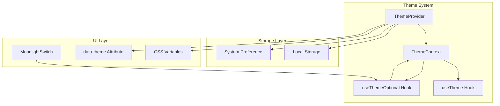

# Design Document: MoonlightSwitch Theme Provider

## Overview

This design upgrades the MoonlightSwitch component to function as a comprehensive theme provider for the GhostUI docs application. The implementation introduces a ThemeProvider context, useTheme/useThemeOptional hooks, and modifies MoonlightSwitch to optionally connect to this context for automatic theme management.

The architecture follows React's context pattern with local storage persistence and system preference detection, enabling seamless theme switching across the entire application.

## Architecture



## Components and Interfaces

### ThemeProvider

The root context provider that manages theme state and side effects.

```typescript
interface ThemeProviderProps {
  children: React.ReactNode;
  defaultTheme?: Theme;
  storageKey?: string;
}

function ThemeProvider({ 
  children, 
  defaultTheme = 'dark', 
  storageKey = 'ghostui-theme' 
}: ThemeProviderProps): JSX.Element;
```

**Responsibilities:**
- Initialize theme from local storage or system preference
- Provide theme context to descendants
- Persist theme changes to local storage
- Apply CSS variables and data-theme attribute to document

### useTheme Hook

Primary hook for accessing theme context. Throws if used outside ThemeProvider.

```typescript
function useTheme(): ThemeContextValue;
```

### useThemeOptional Hook

Safe hook variant that returns undefined outside ThemeProvider context.

```typescript
function useThemeOptional(): ThemeContextValue | undefined;
```

### MoonlightSwitch (Updated)

Enhanced to support both controlled and uncontrolled (context-connected) modes.

```typescript
interface MoonlightSwitchProps extends WithTooltipProps {
  /** Controlled checked state - if omitted, uses ThemeProvider context */
  checked?: boolean;
  /** Change handler - if omitted, uses ThemeProvider context */
  onChange?: (checked: boolean) => void;
  disabled?: boolean;
  className?: string;
  variant?: 'spectral-blood' | 'day-night';
}
```

**Behavior:**
- If `checked` and `onChange` are provided: operates as controlled component
- If omitted: automatically connects to ThemeProvider context
- `checked=true` maps to dark theme, `checked=false` maps to light theme

## Data Models

### Theme Type

```typescript
type Theme = 'light' | 'dark';
```

### ThemeContextValue

```typescript
interface ThemeContextValue {
  theme: Theme;
  setTheme: (theme: Theme) => void;
  toggleTheme: () => void;
}
```

### CSS Variables Schema

```typescript
interface ThemeVariables {
  '--ghost-bg': string;
  '--ghost-bg-secondary': string;
  '--ghost-text': string;
  '--ghost-text-secondary': string;
  '--ghost-border': string;
  '--ghost-accent': string;
}

const darkThemeVariables: ThemeVariables = {
  '--ghost-bg': '#0f172a',
  '--ghost-bg-secondary': '#1e293b',
  '--ghost-text': '#f8fafc',
  '--ghost-text-secondary': '#94a3b8',
  '--ghost-border': '#334155',
  '--ghost-accent': '#8b5cf6',
};

const lightThemeVariables: ThemeVariables = {
  '--ghost-bg': '#f8fafc',
  '--ghost-bg-secondary': '#e2e8f0',
  '--ghost-text': '#0f172a',
  '--ghost-text-secondary': '#475569',
  '--ghost-border': '#cbd5e1',
  '--ghost-accent': '#7c3aed',
};
```

## Correctness Properties

*A property is a characteristic or behavior that should hold true across all valid executions of a system-essentially, a formal statement about what the system should do. Properties serve as the bridge between human-readable specifications and machine-verifiable correctness guarantees.*

### Property 1: Theme Toggle Inverts State
*For any* current theme state (light or dark), clicking the MoonlightSwitch SHALL result in the opposite theme state.
**Validates: Requirements 1.1**

### Property 2: Context Propagation
*For any* theme change via setTheme, all components using useTheme within the ThemeProvider SHALL receive the updated theme value.
**Validates: Requirements 1.2, 3.1, 3.4**

### Property 3: Uncontrolled Mode Context Connection
*For any* MoonlightSwitch rendered without checked/onChange props inside a ThemeProvider, the switch state SHALL reflect the current context theme and toggling SHALL update the context.
**Validates: Requirements 1.3**

### Property 4: Controlled Mode Props Override
*For any* MoonlightSwitch rendered with explicit checked/onChange props, the switch SHALL use those props regardless of ThemeProvider context state.
**Validates: Requirements 1.4**

### Property 5: Local Storage Round-Trip
*For any* theme value, storing via setTheme and then retrieving on next mount SHALL return the same theme value.
**Validates: Requirements 2.1, 2.2**

### Property 6: CSS Variables Match Theme
*For any* theme value, the CSS variables applied to document.documentElement SHALL match the corresponding theme's variable set.
**Validates: Requirements 4.1, 4.2, 4.3**

### Property 7: Data-Theme Attribute Sync
*For any* theme value, the data-theme attribute on the html element SHALL equal the current theme string.
**Validates: Requirements 4.4**

### Property 8: Stored Preference Priority
*For any* stored theme preference, the ThemeProvider SHALL use the stored value over system preference.
**Validates: Requirements 5.3**

## Error Handling

### useTheme Outside Context
When `useTheme` is called outside a ThemeProvider, throw a descriptive error:
```typescript
throw new Error('useTheme must be used within a ThemeProvider');
```

### Invalid Theme Value in Storage
If local storage contains an invalid theme value, fall back to system preference or default:
```typescript
const storedTheme = localStorage.getItem(storageKey);
if (storedTheme !== 'light' && storedTheme !== 'dark') {
  return getSystemPreference() ?? defaultTheme;
}
```

### SSR/Hydration Handling
Use `suppressHydrationWarning` on elements that may differ between server and client renders. Initialize theme state in a useEffect to avoid hydration mismatches.

## Testing Strategy

### Property-Based Testing Library
Use **fast-check** for property-based testing in TypeScript/React environment.

### Unit Tests
- Test ThemeProvider initialization with various configurations
- Test useTheme hook behavior inside and outside context
- Test useThemeOptional hook returns undefined outside context
- Test MoonlightSwitch controlled vs uncontrolled modes

### Property-Based Tests
Each correctness property will be implemented as a property-based test using fast-check:
- Generate random theme sequences and verify state consistency
- Generate random controlled/uncontrolled configurations
- Verify round-trip properties for storage

**Test Configuration:**
- Minimum 100 iterations per property test
- Each test tagged with format: `**Feature: moonlight-switch-theme-provider, Property {number}: {property_text}**`

### Integration Tests
- Test full theme switching flow in docs application
- Verify CSS variables update correctly
- Test persistence across page reloads (manual verification)
