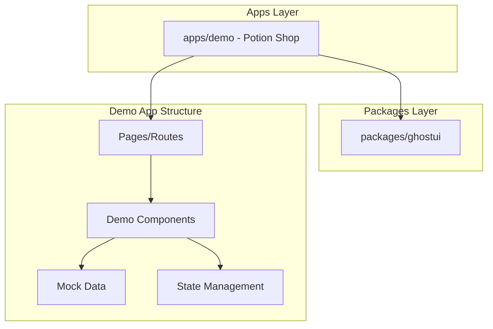

# Design Document: Potion Shop Demo

## Overview

The Cauldron Emporium is a demo e-commerce application that showcases the GhostUI component library in a cohesive, real-world context. The application simulates a spooky potion shop where users can browse magical products, add items to a cart, and complete a checkout flow. This demo serves as both a reference implementation and a living documentation of GhostUI component integration patterns.

The demo will be built as a Next.js application within the existing monorepo structure at `apps/demo`, consuming components from the `@ghostui/react` package.

## Architecture



### Application Structure

```
apps/demo/
├── app/
│   ├── layout.tsx          # Root layout with ThemeProvider, sidebar
│   ├── page.tsx            # Main shop page
│   └── globals.css         # Global styles
├── components/
│   ├── Header.tsx          # Search, cart icon, theme toggle
│   ├── ProductGrid.tsx     # Product card grid with filtering
│   ├── ProductCard.tsx     # Individual product card
│   ├── ProductDrawer.tsx   # Product details drawer
│   ├── CartDrawer.tsx      # Shopping cart drawer
│   ├── CheckoutModal.tsx   # Multi-step checkout
│   └── OrderProgress.tsx   # Order status progress bar
├── data/
│   └── products.ts         # Mock potion data
├── hooks/
│   ├── useCart.ts          # Cart state management
│   └── useProducts.ts      # Product filtering/search
└── types/
    └── index.ts            # TypeScript interfaces
```

## Components and Interfaces

### GhostUI Components Used

| Component | Usage in Demo |
|-----------|---------------|
| GooeySidebar | Main navigation with category links |
| GooeyDrawer | Product details, cart contents |
| CoffinCard | Product display cards |
| SpiritInput | Search field, checkout form inputs |
| SpectralTabs | Category filter tabs |
| GooeyButton | All CTAs (Add to Cart, Checkout, etc.) |
| SpookyTooltip | Product ingredient/effect hints |
| GhostToast | Cart notifications |
| GraveModal | Checkout flow |
| GooeyProgressBar | Order shipping status |
| SpookySkeleton | Loading placeholders |
| MoonlightSwitch | Theme toggle |
| SpookyScrollbar | Custom scrolling |
| HauntedVignette | Ambient edge effect |
| GhostCursor/WispTrail | Cursor effects |
| BatIcon | Decorative icons |

### Key Interfaces

```typescript
interface Product {
  id: string;
  name: string;
  description: string;
  fullDescription: string;
  price: number;
  category: 'potions' | 'elixirs' | 'ingredients' | 'cursed';
  image: string;
  ingredients: string[];
  effects: string[];
  rarity: 'common' | 'uncommon' | 'rare' | 'legendary';
}

interface CartItem {
  product: Product;
  quantity: number;
}

interface Cart {
  items: CartItem[];
  total: number;
}

interface CheckoutForm {
  name: string;
  email: string;
  address: string;
  paymentMethod: string;
}

type OrderStatus = 'brewing' | 'bottling' | 'shipping' | 'delivered';
```

### Component Props Interfaces

```typescript
interface ProductCardProps {
  product: Product;
  onSelect: (product: Product) => void;
  onAddToCart: (product: Product) => void;
}

interface ProductDrawerProps {
  product: Product | null;
  isOpen: boolean;
  onClose: () => void;
  onAddToCart: (product: Product) => void;
}

interface CartDrawerProps {
  cart: Cart;
  isOpen: boolean;
  onClose: () => void;
  onCheckout: () => void;
  onUpdateQuantity: (productId: string, quantity: number) => void;
  onRemoveItem: (productId: string) => void;
}

interface CheckoutModalProps {
  cart: Cart;
  isOpen: boolean;
  onClose: () => void;
  onComplete: () => void;
}
```

## Data Models

### Product Data Structure

Products are stored as mock data with the following structure:

```typescript
const products: Product[] = [
  {
    id: 'moonlit-mending',
    name: 'Moonlit Mending Elixir',
    description: 'Heals wounds under moonlight',
    fullDescription: 'A silvery potion that accelerates healing when consumed during lunar hours...',
    price: 45.99,
    category: 'elixirs',
    image: '/potions/moonlit-mending.png',
    ingredients: ['Moon Petals', 'Silver Dust', 'Unicorn Tears'],
    effects: ['Accelerated Healing', 'Night Vision (temporary)'],
    rarity: 'rare'
  },
  // ... more products
];
```

### Cart State Model

```typescript
interface CartState {
  items: CartItem[];
  isOpen: boolean;
  addItem: (product: Product) => void;
  removeItem: (productId: string) => void;
  updateQuantity: (productId: string, quantity: number) => void;
  clearCart: () => void;
  total: number;
}
```

## Correctness Properties

*A property is a characteristic or behavior that should hold true across all valid executions of a system-essentially, a formal statement about what the system should do. Properties serve as the bridge between human-readable specifications and machine-verifiable correctness guarantees.*

Based on the prework analysis, the following properties can be verified through property-based testing:

### Property 1: Category filtering returns only matching products
*For any* category selection, all products displayed in the grid should belong to that category.
**Validates: Requirements 1.2, 4.4**

### Property 2: Product cards contain all required fields
*For any* product in the data set, when rendered as a card, the output should contain the product name, price, and description.
**Validates: Requirements 2.2**

### Property 3: Product drawer displays complete details
*For any* product, when the detail drawer is opened, all product fields (name, fullDescription, ingredients, effects, price) should be present in the rendered output.
**Validates: Requirements 3.2**

### Property 4: Search filtering returns relevant products
*For any* search query, all products returned should have names or descriptions that match the query string (case-insensitive).
**Validates: Requirements 4.2**

### Property 5: Cart displays all items with required details
*For any* cart state with items, each item should be rendered with its name, quantity, and calculated price.
**Validates: Requirements 5.2**

### Property 6: Adding to cart triggers toast notification
*For any* product added to cart, a GhostToast notification should be triggered.
**Validates: Requirements 5.4**

### Property 7: Theme toggle round-trip
*For any* initial theme state, toggling the MoonlightSwitch twice should return to the original theme.
**Validates: Requirements 8.2**

### Property 8: Cart total calculation
*For any* cart with items, the total should equal the sum of (item.price × item.quantity) for all items.
**Validates: Requirements 5.3**

## Error Handling

### Loading States
- Display SpookySkeleton components while products are loading
- Show skeleton placeholders that match the dimensions of actual product cards
- Gracefully handle empty product lists with a friendly message

### Cart Operations
- Validate quantity inputs (minimum 1, maximum stock limit)
- Handle edge cases when removing the last item from cart
- Prevent checkout with empty cart

### Form Validation
- Validate required fields in checkout form using SpiritInput validation states
- Display inline error messages for invalid inputs
- Disable submit button until form is valid

### Network Errors (Simulated)
- Display GhostToast error notifications for failed operations
- Provide retry mechanisms where appropriate

## Testing Strategy

### Unit Testing Framework
- Use Vitest as the test runner (consistent with existing packages)
- Use React Testing Library for component testing
- Co-locate tests with components using `.test.tsx` suffix

### Property-Based Testing
- Use fast-check library for property-based tests
- Configure minimum 100 iterations per property test
- Tag each property test with format: `**Feature: potion-shop-demo, Property {number}: {property_text}**`

### Test Categories

#### Unit Tests
- Component rendering tests (verify components render without errors)
- User interaction tests (click handlers, form submissions)
- State management tests (cart operations, filtering)

#### Property-Based Tests
- Filtering logic (category and search)
- Cart calculations
- Data rendering completeness
- Theme toggle behavior

#### Integration Tests
- Full user flows (browse → add to cart → checkout)
- Component composition (sidebar + main content interaction)

### Test File Structure
```
apps/demo/
├── components/
│   ├── ProductCard.tsx
│   ├── ProductCard.test.tsx
│   ├── ProductCard.property.test.tsx
│   └── ...
├── hooks/
│   ├── useCart.ts
│   ├── useCart.test.ts
│   └── useCart.property.test.ts
└── ...
```
