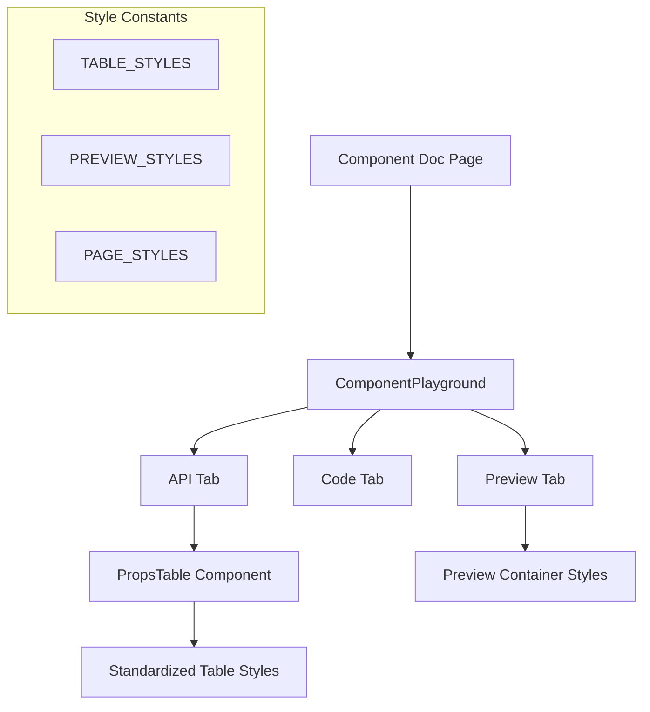

# Design Document: Docs Styling Consistency

## Overview

This design standardizes CSS and styling across all component documentation pages in the GhostUI docs application. The solution focuses on three key areas:

1. **Props Table styling** - Consistent API documentation tables with standardized columns, colors, and typography
2. **Preview Container styling** - Unified preview areas with consistent heights, backgrounds, and borders
3. **Page Header styling** - Standardized headings and typography across all pages

### Current Inconsistencies

**Props Tables:**
- Some pages use inline table definitions, others use PropsTable component
- Inconsistent column structures (some have 3 columns, some have 4)
- Varying header backgrounds and text colors

**Preview Containers:**
- Varying min-heights: `h-[200px]`, `h-[300px]`, `h-[350px]`, `h-[400px]`, `h-[500px]`, `h-[700px]`
- Inconsistent padding and backgrounds

**Page Headers:**
- Some use `text-4xl`, others use `text-5xl`
- Inconsistent color classes (`text-ghost-purple` vs `text-ghost-white`)

## Architecture



## Components and Interfaces

### 1. PropsTable Component (`apps/docs/components/PropsTable.tsx`)

The standardized props table matching the reference design:

```typescript
interface PropDefinition {
  name: string;
  type: string;
  required?: boolean;
  default?: string;
  description: string;
}

interface PropsTableProps {
  props: PropDefinition[];
  className?: string;
}

export function PropsTable({ props, className }: PropsTableProps) {
  return (
    <div className={cn("bg-[#0a0412] border border-ghost-purple/20 rounded-lg overflow-hidden", className)}>
      <table className="w-full text-sm">
        <thead className="bg-ghost-purple/10 border-b border-ghost-purple/20">
          <tr>
            <th className="text-left px-4 py-3 text-ghost-white font-semibold">Prop</th>
            <th className="text-left px-4 py-3 text-ghost-white font-semibold">Type</th>
            <th className="text-left px-4 py-3 text-ghost-white font-semibold">Required</th>
            <th className="text-left px-4 py-3 text-ghost-white font-semibold">Description</th>
          </tr>
        </thead>
        <tbody className="divide-y divide-ghost-purple/10">
          {props.map((prop) => (
            <tr key={prop.name}>
              <td className="px-4 py-3 text-ghost-white/90 font-mono">{prop.name}</td>
              <td className="px-4 py-3 text-ghost-white/70 font-mono text-xs">{prop.type}</td>
              <td className="px-4 py-3 text-ghost-white/70">{prop.required ? 'Yes' : 'No'}</td>
              <td className="px-4 py-3 text-ghost-white/70">{prop.description}</td>
            </tr>
          ))}
        </tbody>
      </table>
    </div>
  );
}
```

### 2. Table Style Constants

```typescript
export const TABLE_STYLES = {
  container: 'bg-[#0a0412] border border-ghost-purple/20 rounded-lg overflow-hidden',
  table: 'w-full text-sm',
  thead: 'bg-ghost-purple/10 border-b border-ghost-purple/20',
  th: 'text-left px-4 py-3 text-ghost-white font-semibold',
  tbody: 'divide-y divide-ghost-purple/10',
  td: 'px-4 py-3',
  propName: 'text-ghost-white/90 font-mono',
  propType: 'text-ghost-white/70 font-mono text-xs',
  propRequired: 'text-ghost-white/70',
  propDescription: 'text-ghost-white/70',
} as const;
```

### 3. Preview Style Constants

```typescript
export const PREVIEW_SIZES = {
  sm: 'min-h-[200px]',
  md: 'min-h-[350px]',
  lg: 'min-h-[500px]',
  xl: 'min-h-[700px]',
} as const;

export const PREVIEW_STYLES = {
  container: 'flex items-center justify-center rounded-lg border border-ghost-gray/20 bg-black p-8',
} as const;
```

### 4. Page Style Constants

```typescript
export const PAGE_STYLES = {
  h1: 'text-5xl font-display text-ghost-white',
  lead: 'lead text-ghost-white/80',
  h2: 'text-3xl font-display text-ghost-white mt-12',
  h3: 'text-2xl font-display text-ghost-white mt-8',
  prose: 'prose prose-invert max-w-none',
} as const;
```

## Data Models

### Props Table Column Structure

| Column | Width | Typography | Color |
|--------|-------|------------|-------|
| Prop | auto | font-mono | ghost-white/90 |
| Type | auto | font-mono text-xs | ghost-white/70 |
| Required | ~80px | normal | ghost-white/70 |
| Description | flex | normal | ghost-white/70 |

### Preview Size Mapping

| Size | Min Height | Use Case |
|------|------------|----------|
| sm | 200px | Toggles, small loaders |
| md | 350px | Standard components (default) |
| lg | 500px | Forms, textareas |
| xl | 700px | Sidebars, large layouts |

## Correctness Properties

*A property is a characteristic or behavior that should hold true across all valid executions of a system-essentially, a formal statement about what the system should do. Properties serve as the bridge between human-readable specifications and machine-verifiable correctness guarantees.*

### Property 1: PropsTable renders all four columns
*For any* valid props array passed to PropsTable, the rendered table SHALL contain exactly four column headers: Prop, Type, Required, and Description.
**Validates: Requirements 2.1**

### Property 2: PropsTable applies correct header styling
*For any* PropsTable instance, the thead element SHALL have classes including bg-ghost-purple/10 and border-b border-ghost-purple/20.
**Validates: Requirements 2.2**

### Property 3: PropsTable applies correct row styling
*For any* PropsTable with multiple props, the tbody element SHALL have the divide-y divide-ghost-purple/10 classes for row dividers.
**Validates: Requirements 2.3**

### Property 4: Prop names use monospace font
*For any* prop rendered in PropsTable, the prop name cell SHALL have the font-mono class applied.
**Validates: Requirements 2.4**

### Property 5: Preview container applies base styles
*For any* ComponentPlayground preview, the container SHALL include bg-black, border, rounded-lg, and centering classes.
**Validates: Requirements 1.2, 1.3**

### Property 6: Custom className merges correctly
*For any* custom className passed to PropsTable or ComponentPlayground, the resulting className SHALL contain both base styles and custom classes.
**Validates: Requirements 4.3**

## Error Handling

| Scenario | Handling |
|----------|----------|
| Empty props array | Render table with headers only, no rows |
| Missing required field | Default to false |
| Missing default field | Display '-' |
| Invalid size variant | Fall back to 'md' |

## Testing Strategy

### Unit Tests
- Test PropsTable renders correct column structure
- Test PropsTable applies correct CSS classes to each element
- Test className merging with tailwind-merge

### Property-Based Tests
Using `fast-check` library:

1. **Column structure**: For all valid props arrays, verify 4 columns are rendered
2. **Styling consistency**: For all inputs, verify base styles are always present
3. **Class merging**: For all className combinations, verify correct merge behavior

### Visual Verification
- Compare rendered tables against reference design
- Verify consistent appearance across all component pages
