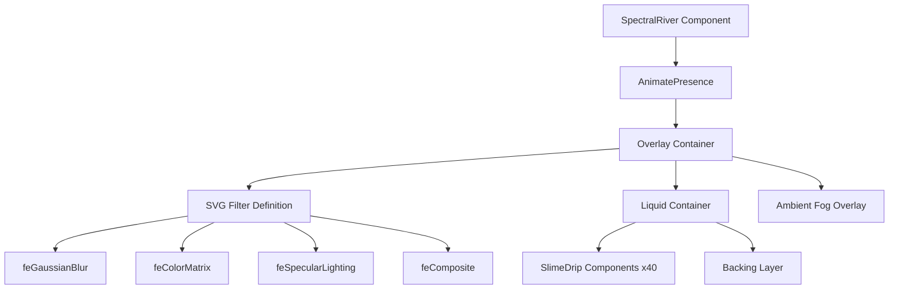

# Design Document: SpectralRiver Implementation

## Overview

SpectralRiver is a dramatic full-screen page transition component that creates a liquid slime/goo animation effect. The component renders animated purple drips that flow from top to bottom, using SVG filters to achieve a realistic liquid appearance with specular lighting. It follows the established patterns of other GhostUI page transitions (VeilFade, CrackTransition, BloodSmear, ShadowCrawl, BatBurst).

The component will be implemented using the exact code snippet provided, with minor adaptations to fit the library's conventions (using the shared `cn` utility instead of a local one).

## Architecture



### Component Hierarchy

1. **SpectralRiver** (main export) - Controls visibility, scroll locking, and completion callback
2. **SlimeDrip** (internal) - Renders individual animated drip columns with organic variability

### Integration Points

- Exports from `packages/ghostui/src/components/SpectralRiver.tsx`
- Re-exported via `packages/ghostui/src/components/index.ts`
- Documentation page at `apps/docs/app/docs/components/spectral-river/page.tsx`
- Sidebar navigation update in `apps/docs/components/Sidebar.tsx`

## Components and Interfaces

### SpectralRiverProps Interface

```typescript
export interface SpectralRiverProps {
    /** Controls whether the transition is active */
    isActive: boolean;
    /** Callback invoked when the transition animation completes */
    onComplete?: () => void;
}
```

### SlimeDrip Internal Component

```typescript
interface SlimeDripProps {
    index: number;
    total: number;
}
```

The SlimeDrip component calculates:
- **Width**: Globs (30% chance) are 10-25vw, strings are 2-8vw
- **Position**: Grid-based with jitter for organic distribution
- **Duration**: Globs take 3-4.5s, strings take 2-3.5s
- **Delay**: Random 0-0.5s stagger

### Component Behavior

1. When `isActive` becomes `true`:
   - Set `document.body.style.overflow = 'hidden'`
   - Render the overlay with drips and filters
   - Start a 4500ms timer for completion

2. When timer completes:
   - Call `onComplete()` if provided
   - Restore `document.body.style.overflow`

3. On unmount during active transition:
   - Clear the timer
   - Restore body overflow

## Data Models

### Configuration Constants

```typescript
const NUM_DRIPS = 40;
const COLORS = ['bg-[#A855F7]'];
const TRANSITION_DURATION = 4500; // ms
```

### SVG Filter Configuration

The goo filter uses:
- **Gaussian Blur**: stdDeviation="10" for initial blur
- **Color Matrix**: values="1 0 0 0 0  0 1 0 0 0  0 0 1 0 0  0 0 0 18 -7" for alpha threshold
- **Secondary Blur**: stdDeviation="5" for specular smoothing
- **Specular Lighting**: surfaceScale="8", specularConstant="1.2", specularExponent="25"
- **Distant Light**: azimuth="225", elevation="60"

## Correctness Properties

*A property is a characteristic or behavior that should hold true across all valid executions of a system-essentially, a formal statement about what the system should do. Properties serve as the bridge between human-readable specifications and machine-verifiable correctness guarantees.*

Based on the prework analysis, the following properties can be verified through property-based testing:

### Property 1: Active state renders overlay

*For any* render of SpectralRiver with `isActive=true`, the component SHALL render a visible overlay container in the DOM.

**Validates: Requirements 1.2**

### Property 2: Inactive state renders nothing

*For any* render of SpectralRiver with `isActive=false`, the component SHALL not render any overlay content in the DOM.

**Validates: Requirements 1.3**

### Property 3: Drip widths within bounds

*For any* SlimeDrip rendered during an active transition, its computed width SHALL be between 2vw and 25vw inclusive.

**Validates: Requirements 2.1**

### Property 4: Drip delays within bounds

*For any* SlimeDrip rendered during an active transition, its animation delay SHALL be between 0 and 0.5 seconds inclusive.

**Validates: Requirements 2.3**

## Error Handling

### Edge Cases

1. **Rapid toggle**: If `isActive` toggles rapidly, AnimatePresence handles exit animations gracefully
2. **Missing callback**: `onComplete` is optional; the component functions without it
3. **SSR**: The component uses `'use client'` directive and accesses `document` only in useEffect

### Cleanup Strategy

- Timer cleanup in useEffect return function
- Body overflow restoration on unmount
- No memory leaks from orphaned timers

## Testing Strategy

### Property-Based Testing

The project uses **fast-check** for property-based testing (already configured in package.json).

Each property-based test MUST:
- Run a minimum of 100 iterations
- Be tagged with format: `**Feature: spectral-river-implementation, Property {number}: {property_text}**`
- Reference the correctness property from this design document

### Unit Tests

Unit tests will cover:
- Component renders when isActive is true
- Component does not render when isActive is false
- onComplete callback is invoked after transition duration
- Body overflow is set to hidden when active
- Body overflow is restored on completion
- Cleanup occurs on unmount during active transition
- SVG filter elements are present in DOM when active

### Test File Location

Tests will be co-located with the component:
- `packages/ghostui/src/components/SpectralRiver.test.tsx`

### Testing Tools

- **Vitest**: Test runner (already configured)
- **@testing-library/react**: Component rendering and queries
- **fast-check**: Property-based testing
- **jsdom**: DOM environment
